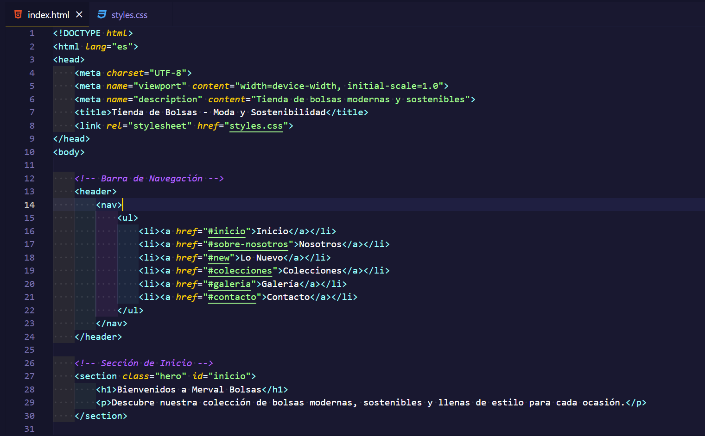

# 👝 Tienda de Bolsas - Moda y Sostenibilidad
Este proyecto es una página web de una tienda de bolsas modernas y sostenibles. La página está organizada en diferentes secciones para presentar las colecciones, una galería de imágenes, testimonios de clientes, información de contacto y una descripción de la empresa.

## 📋 Características
- **Diseño moderno**: La interfaz presenta un estilo limpio y funcional, con diferentes secciones claramente delimitadas.
- **Colecciones destacadas**: Muestra varias colecciones de bolsas, desde clásicas y elegantes hasta deportivas y ecológicas.
- **Galería de imágenes**: Una galería visual para mostrar imágenes de los productos destacados.
- **Sección de testimonios**: Comentarios de clientes que destacan la calidad y estilo de los productos.
- **Formulario de contacto**: Permite a los usuarios enviar preguntas o solicitar información adicional.

## 🏗️ Estructura de la Página

### Navegación
La barra de navegación permite a los usuarios desplazarse fácilmente entre las diferentes secciones.

### Secciones de Contenido
1. **Inicio**: Bienvenida a la tienda con un mensaje introductorio.
2. **Sobre Nosotros**: Información sobre la misión y los valores de la tienda, enfocada en la sostenibilidad y la moda.
3. **Colecciones**: Detalla varias categorías de bolsas:
   - **Clásica**: Bolsas con diseño atemporal y durabilidad.
   - **Elegante**: Bolsas para eventos y entornos formales.
   - **Minimalista**: Bolsas simples y funcionales.
   - **Ecológica**: Bolsas hechas con materiales sostenibles.
   - **Deportiva**: Diseños prácticos para actividades deportivas.
4. **Galería**: Muestra imágenes de algunos productos destacados.
5. **Testimonios**: Comentarios de clientes satisfechos.
6. **Contacto**: Formulario para que los usuarios puedan enviar consultas.

## Instrucciones para Desplegar

### Requisitos Previos

- Navegador web (Google Chrome, Firefox, Edge, Safari, etc.)
- Editor de código (opcional, como VSCode o Atom)

### Pasos para Ejecutar el Proyecto Localmente

1. **Clona el repositorio** en tu máquina local:
   ```bash
   git clone https://github.com/usuario/tienda-de-bolsas.git

2. Navega al directorio del proyecto
   ```bash
   cd nombre-de-la-carpeta
   
4. Abre el archivo index.html en tu navegador preferido para visualizar la página


### 🖼️ Imagen del código


